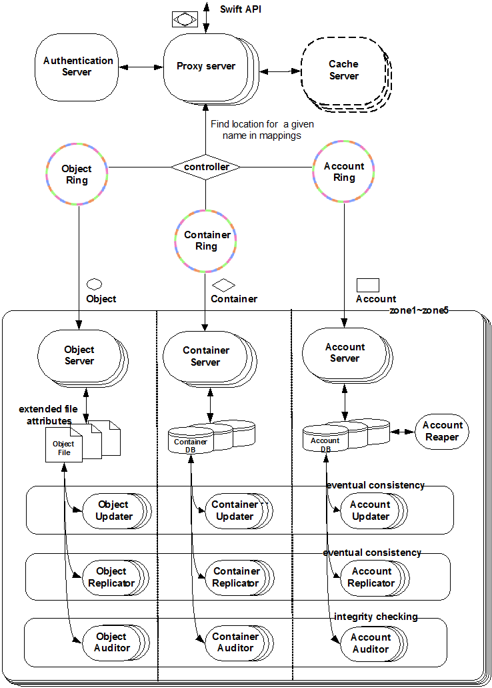

## 一、云计算

### 1.概念：

将计算、存储、网络等资源的弹性管理（IaaS），将资源虚拟化，池化进行调度，提供给用户远程使用；

### 2.类型：

公有云、私有云、混合云、行业云；

### 3.特点：

- 虚拟化和自动化；
- 服务器、存储介质、网络等资源都可以随时替换；
- 所有资源都由云端统一管理；
- 高度伸缩满足业务需求；
- 集中将业务传递给业务。

### 4.厂商：

AWS、阿里云、腾讯云等；开源的OpenStack

## 二、OpenStack

### 1.简介：

由Rackspace和NASA合作创办，一整套开源软件项目的综合体，可以允许企业或服务商建立运行自己的云计算和存储设施。

### 2.重要服务组成：

- Keystone--认证服务；
- Nova--计算服务；
- Neutron--网络服务；
- Galance--镜像服务；
- Cinder--块存储服务；
- dashboard--Web管理界面

### 3.服务介绍：

#### 3.1nova服务

核心的虚拟化管理程序，实例的生命周期（创建、删除、重启虚拟机）管理，使用libvirt API与Hypervisors交互虚拟化资源。

分为两类节点：

- 控制节点和计算节点；

- 控制节点包括网络控制 Network、调度管理 Scheduler、api服务、存储卷管理、数据库管理、身份管理和镜像管理等，计算节点主要提供 nova-compute 服务

包含的服务有：

- API Server(nova-api);

- Message Queue(rabbitmq-server);

- Compute Workers(nova-compute);

- Network Controller(nova-network);

- Volume Worker(nova-volume);

- Scheduler(nova-scheduler);

nova的各个组件是以数据库和队列为中心进行通信的。

nova启动实例工作流程：

- 通过API创建实例请求，转发到Queue和Database，Queue发送消息通知Scheduler，选择一个host去执行创建命令，对应的Compute会真正执行这个创建操作，但是这个步骤和Galance密不可分，需要调度到galance-api去获取相关的镜像数据，最后才通过Network分配一些网络资源。

#### 3.2keystone服务

提供身份认证和授权的组件，类似于一个服务总线，通过keystone注册endpoint，任何服务之间相互调用，必须经过keystone进行身份验证。

包含domain、project、user、role、token

- domain - 表示 project 和 user 的集合，在公有云或者私有云中常常表示一个客户
- group - 一个domain 中的部分用户的集合
- project - it基础设施资源的集合，比如虚机，卷，镜像等
- role - 角色，表示一个 user 对一个 project resource 的权限
- token - 一个 user 对于某个目标（project 或者 domain）的一个有限时间段内的身份令牌

在domain中创建project、user，并将project权限分配给user，给user分配role权限，一个admin角色，可以操作OpenStack cloud中的所有资源。

#### 3.3neutron服务

提供云计算虚拟环境下网络的功能，包含二层交换、三层路由、负载均衡、防火墙等，可以灵活的划分物理网络，在多租户的环境下给用户提供单独的网络环境。

包含的模块：Networks、Roters、Security Groups、Floating IPs

VLAN：虚拟局域网，将同一网络划分为多个逻辑上的虚拟子网，收到广播报文时，仅仅在其所在的VLAN中进行广播，防止广播泛滥；最大的ID数量为4096个（0~4095），可用的为1~4094；

VXLAN：在三层网络的基础上构建大二层网络，其物理承载的是传统的三层网络以及专用的VTEP设备，最大ID数有1600多万个。

区别：

- VLAN知识修改了原始以太网帧头部，但是整个网络数据包还是原来的数据包，而VXLAN则是将原始的以太网帧隐藏在UDP数据里面，传输细节对于虚拟机透明，从而做到在L3网络上构建虚拟L2网络。

优点：

- 支持的网络数量更多；

- 更灵活的部署虚拟机部署，可以实现在三层网络上构建大二层网络，可以通过UDP在L3上传输L2的数据，便于虚拟机迁移

L2：七层网络协议的第二层数据链路层，传输的Mac地址为基础

L3：七层网络协议的网络层，是以ip地址为基础

用户创建网络过程：

- 创建网络和子网；
- 创建路由Router连接租户网络的子网和外部网络；
- 创建浮动IP连接虚拟机。

SNAT：源网络地址转换，虚拟机访问外网时，内网IP地址转换为外网网关IP地址，使虚拟机能够直接访问外网。

DNAT：目标网络地址转换，需要先设置浮动IP，浮动IP关联对应的端口到所在的子网，从外网访问虚拟机实例时，目的IP地址为实例的浮动IP地址，因此必须由lptables将其转化成固定的IP地址，然后在将其路由到实例。一旦设置浮动IP地址后，源地址转换就不在使用外网关的IP地址了，而是直接使用对应的浮动IP地址，虽然相关的NAT规则依然存在，但是neutron-l3-agent-float-snat比neutron-l3-agent-snat更早执行

#### 3.4Glance服务

是一个提供发现、注册和下载镜像的服务。通过api课可以查询镜像元数据，下载镜像。可以当作模板来存储用于启动新实例，还可以创建快照备份虚拟机。

架构：Glance-api、Glance-registry、Store Adapter、Database

支持的镜像格式：

- raw：无格式镜像，KVM和Xen都支持这种格式；

- iso：磁盘镜像，通常用于cd和dvd；

- qcow2：QEMU 模拟器支持的一种磁盘镜像，支持写时复制，极小的空间占用；

- vhd、vhdx、vdi等等；

支持后端存储：

- file：默认配置，在本地文件系统保存镜像；

- http：通过http服务获取镜像，这种只能只读；

- rdb：使用Ceph的RBD接口存储到Ceph集群中；

- swift：对象存储；

- cinder：块存储；

#### 3.5Cinder服务

块存储服务，提供对volume从创建到删除的整个生命周期的管理。从实例角度来看，挂载的每一个volume都是一块硬盘。

架构：Cinder Client、Api、Volume、Scheduler、Backup、Database。

volume支持多种Provider，包括LVM、NFS、Ceph、Emc

 #### 3.6Swift服务

对象存储服务（Object Storage）软件层面引入一致性散列技术和数据冗余性，牺牲一定程度上的数据一致性来达到高可用性和可伸缩性，支持多用户模式、容器和对象读写操作，解决互联网下非结构化数据存储问题。

组件：

- 代理服务（Proxy Server）：对外提供对服务的Api，会根据环的信息来查找服务地址并转发用户的请求到相应的账户、容器或者对象服务；
- 认证服务（Authentication Server）：验证访问用户的身份信息，并获得一个对象访问令牌，在一定时间内会一直有效；
- 缓存服务（Cahe Server）：缓存的内容包括对象服务令牌、账户和容器的存在信息，但不会缓存对象本身的数据；
- 账户服务（Account Server）：提供账户元数据和统计信息，并维护所含容器列表的服务，每个账户的信息被存储在一个SQLite数据库中；
- 容器服务（Container Server）：提供容器元数据和统计信息，并维护所含对象列表服务，每个容器信息也存储在一个SQLite数据库中；
- 对象服务（Object Server）：童工对象元数据和内容服务，每个对象的内容以文件形式存储在文件系统中，元数据会作为文件属性来存储；
- 复制服务（Replicator）：会检测本地分区副本和远程副本是否一致，不一致会push更新远程副本；
- 更新服务（Updater）：当对象由于高负载的原因而无法立即更新时，任务将会被序列化到在本地文件系统中进行排队，以便服务恢复后进行异步更新；例如成功创建对象后容器服务器没有及时更新对象列表，这个时候容器的更新操作就会进入排队中，更新服务会在系统恢复正常后扫描队列并进行相应的更新处理。
- 审计服务（Auditor）：检查对象，容器和账户的完整性，如果发现比特级的错误，文件将被隔离，并复制其他的副本以覆盖本地损坏的副本；其他类型的错误会被记录到日志中。
- 账户清理服务（Account Reaper）：移除被标记为删除的账户，删除其所包含的所有容器和对象。

