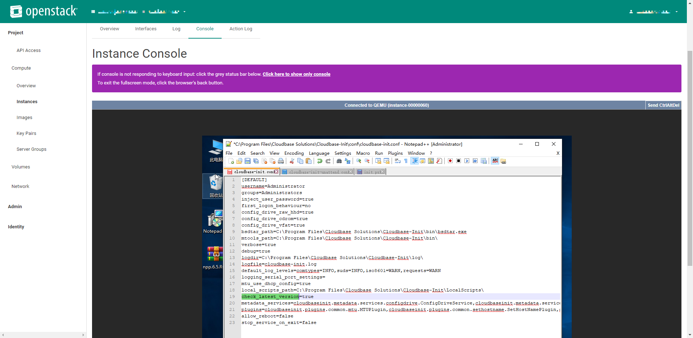

# OpenStack初始化用户和创建实例流程

## 一、初始化用户

包含用户的权限模块和网络模块，权限多区域共用（keystone服务），网络各区域私有（neutron）。权限用于用户获取token认证，以访问OpenStack各个服务；网络用于用户创建实例时使用。

### 1.1权限模块

```java
1.创建project；
2.创建user；
3.将user分配role并绑定到project。
```


### 1.2网络模块

```java
1.创建network；
2.创建subnet;
3.创建router;
4.将router绑定到subnet;
5.创建security group;
6.创建security group rule。
```

## 二、创建实例

创建实例包含核心流程和非核心流程（附属条件）。核心流程是实例成功创建并且能访问使用；非核心流程则是实例的一些附加条件，并不影响实例的使用，例如Qos、volume等。

### 2.1核心流程

```java
1.创建instance；
2.创建floating ip；
3.将floating ip绑定到instance；
4.将浮动ip通过端口号映射到routerOS服务。
```

### 2.2非核心流程

```java
1.创建qos-policy；
2.创建qos policy bandwidth rule；
3.将qos policy绑定到floatingIp；
4.创建volume；
5.将volume绑定到instance。
```
## 三、修改密码
修改密码需要在镜像中安装云初始化程序：cloud-init(适用于Linux)/cloudbase-init(适用于Windows)
目前是windows镜像，配置方法:
需要修改cloudbase-init.conf文件，修改密码通过驱动会访问元数据服务：http://169.254.169.254

```editorconfig
[DEFAULT]
# 创建什么用户以及用户属于什么组.
username=Admin          #一般都是改为Administrator
groups=Administrators
inject_user_password=true  # 从元数据中获取密码 (非随机).

# 那个设备是可能的配置驱动 (元数据).
config_drive_raw_hhd=true
config_drive_cdrom=true

# 与ubuntu中功能相同的tar命令默认路径.
bsdtar_path=C:\Program Files (x86)\Cloudbase Solutions\Cloudbase-Init\bin\bsdtar.exe
# 日志等级.
verbose=true
debug=true
# 日志存放路径.
logdir=C:\Program Files (x86)\Cloudbase Solutions\Cloudbase-Init\log\
logfile=cloudbase-init-unattend.log
default_log_levels=comtypes=INFO,suds=INFO,iso8601=WARN
logging_serial_port_settings=
# 启用最大传输单元和时间同步服务.
mtu_use_dhcp_config=true
ntp_use_dhcp_config=true
# 存放用户用于执行的脚本的路径.
local_scripts_path=C:\Program Files (x86)\Cloudbase Solutions\Cloudbase-Init\LocalScripts\
# 服务将会检测以下驱动直到某个能够成功获取元数据.
metadata_services=cloudbaseinit.metadata.services.configdrive.ConfigDriveService, #可以开启ConfigDrive和httpservice（Openstack）
                  cloudbaseinit.metadata.services.httpservice.HttpService,
                  cloudbaseinit.metadata.services.ec2service.EC2Service,
                  cloudbaseinit.metadata.services.maasservice.MaaSHttpService
# 需要执行的插件.
plugins=cloudbaseinit.plugins.common.mtu.MTUPlugin,
        cloudbaseinit.plugins.common.sethostname.SetHostNamePlugin,
        cloudbaseinit.plugins.windows.extendvolumes.ExtendVolumesPlugin,
        cloudbaseinit.plugins.windows.userdata.UserDataPlugin,
        cloudbaseinit.plugins.windows.setuserpassword.SetUserPasswordPlugin,
        cloudbaseinit.plugins.windows.localscripts.LocalScriptsPlugin
# 其他配置.
allow_reboot=false    # allow the service to reboot the system
stop_service_on_exit=false
```
Cloudbase-init 能够通过特定的插件执行用户提供的脚本（PowerShell、Python、Batch 或 Bash 脚本），这些脚本通常位于默认路径 C:\Program Files (x86)\Cloudbase Solutions\Cloudbase-Init\LocalScripts中
PowerShell脚本配置如下：

- 需要设置powershell参数：
由于windows会将密码注册到注册表里，所以每次需要删除注册表，重启再从元数据获取密码信息。
```shell
Remove-Item -Recurse "HKLM:\\Software\Cloudbase Solutions" #删除注册表
net start w32time
w32tm /resync /force  #同步时间
exit 1002    #退出码
```

退出码有三种：
```shell
1001:重新启动，下次启动时不要再次运行插件
1002:现在不要重启，下次启动时再次运行插件
1003:重启并在下次启动时再次运行插件
```